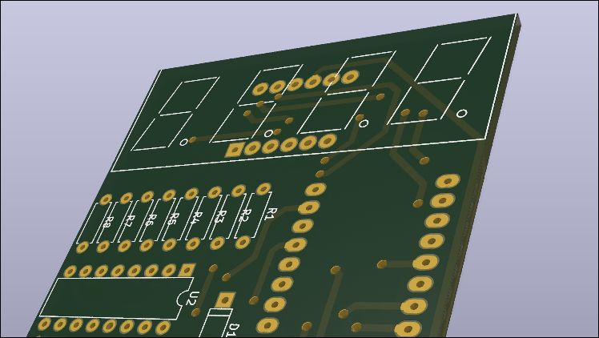

# Velocímetro para Bicicleta com Display 7 Segmentos

Este repositório contém o código-fonte e os arquivos de projeto PCB para um velocímetro digital para bicicleta com display de 7 segmentos.

<div align="center">
  
</div>

## Descrição do Projeto

Este projeto implementa um sistema completo de monitoramento para bicicleta que exibe informações em um display de 7 segmentos multiplexado. O sistema oferece quatro modos de operação diferentes, permitindo ao ciclista visualizar velocidade, distância percorrida, tempo de viagem e nível de bateria.

## Funcionalidades

### Modos de Operação

1. **Velocímetro (Speedometer)**
   - Exibe a velocidade atual em km/h
   - Cálculo baseado em detecção de ímã via sensor Hall
   - Indicador visual de detecção de movimento

2. **Odômetro (Odometer)**
   - Mostra a distância total percorrida em metros
   - Resetável com pressão longa do botão secundário (2 segundos)

3. **Cronômetro (Chronometer)**
   - Mede o tempo de viagem em formato MM:SS
   - Funcionalidades de pausar/retomar
   - Resetável com pressão longa do botão secundário (2 segundos)

4. **Monitor de Bateria (Battery)**
   - Exibe o nível de tensão da bateria
   - Cálculo baseado na referência interna de 1.1V do microcontrolador

## Componentes de Hardware

### Microcontrolador
- Arduino (compatível com ATmega328P ou similar)
- Suporta múltiplas variantes AVR (ATmega32U4, ATmega1280, ATmega2560, ATtiny, etc.)

### Display
- 4 dígitos de display de 7 segmentos
- Multiplexação por time-division para controle eficiente
- Controlado via shift register (74HC595 ou similar)

### Sensores e Entradas
- **Sensor Hall** (pino 2): Detecta passagem de ímãs na roda
- **Botão de Operação** (pino A1): Alterna entre modos
- **Botão Secundário** (pino A0): Funções específicas por modo

### Saídas
- **Shift Register**:
  - Data Pin (pino 4)
  - Clock Pin (pino 5)
  - Latch Pin (pino 7)
- **Multiplexação de Dígitos** (pinos 6, 9, 10, 11)
- **Buzzer** (pino 10) - opcional

## Estrutura do Repositório

```
7seg-bicycle/
├── src/
│   └── 7seg-bycicle.ino    # Código-fonte principal do Arduino
├── pcb/
│   ├── 3LBycicle.sch       # Esquemático do circuito (KiCad)
│   ├── 3LBycicle.kicad_pcb # Layout da placa (KiCad)
│   └── 7s36.pretty/        # Bibliotecas de footprints para displays
└── README.md               # Este arquivo
```

## Atribuições de Pinos

### Pinos Digitais
- **Pino 2**: Sensor Hall (interrupção externa)
- **Pino 4**: Data (shift register)
- **Pino 5**: Clock (shift register)
- **Pino 6**: Multiplexação dígito 1
- **Pino 7**: Latch (shift register)
- **Pino 9**: Multiplexação dígito 2
- **Pino 10**: Multiplexação dígito 3 / Buzzer
- **Pino 11**: Multiplexação dígito 4

### Pinos Analógicos
- **Pino A0**: Botão secundário
- **Pino A1**: Botão de operação (troca de modo)

## Parâmetros de Configuração

### Físicos
- **Raio da roda**: 0.34 metros (ajustável no código)
- **Número de dentes/ímãs**: 8
- **Distância por tick**: ~0.267 metros (calculado como: 2π × raio / número de dentes)

### Temporais
- **Período de amostragem**: 1000ms (1 segundo)
- **Delay de debounce**: 250ms
- **Tempo de pressão longa**: 2000ms (2 segundos)
- **Timer de atualização**: 1Hz (via Timer1)

## Instruções de Uso

### Compilação e Upload
1. Abra o arquivo `src/7seg-bycicle.ino` no Arduino IDE
2. Selecione a placa Arduino correta e a porta serial
3. Compile e faça o upload do código

### Operação
- **Trocar modo**: Pressione o botão de operação (A1)
- **Velocímetro**: Botão secundário (A0) alterna indicador visual
- **Odômetro**: Pressione e segure o botão secundário por 2 segundos para resetar
- **Cronômetro**: 
  - Pressione o botão secundário para pausar/retomar
  - Pressione e segure por 2 segundos para resetar (quando pausado)
- **Bateria**: Modo apenas de visualização

## Detalhes Técnicos

### Cálculo de Velocidade
O sistema utiliza dois métodos de cálculo:
1. **Método diferencial**: Calcula velocidade instantânea baseada no tempo entre detecções consecutivas de ímã
2. **Método de média**: Calcula velocidade média baseada em contagem de ticks durante período de amostragem

### Multiplexação do Display
O display é atualizado via multiplexação por time-division, alternando rapidamente entre os 4 dígitos para criar a ilusão de exibição simultânea.

### Interrupções
- **Interrupção externa**: Sensor Hall no pino 2 (CHANGE)
- **Interrupção de timer**: Timer1 configurado para 1Hz para atualização periódica de velocidade

### Medição de Bateria
A tensão da bateria é medida usando a referência interna de 1.1V do microcontrolador, permitindo medição precisa sem componentes externos adicionais.

## Licença

Este projeto é fornecido como está, para fins educacionais e de hobby.

## Notas

- Os valores de calibração (raio da roda, número de dentes) devem ser ajustados conforme sua bicicleta específica
- O código inclui suporte para múltiplas variantes de microcontroladores AVR
- O projeto inclui arquivos PCB no formato KiCad para fabricação de placa customizada

